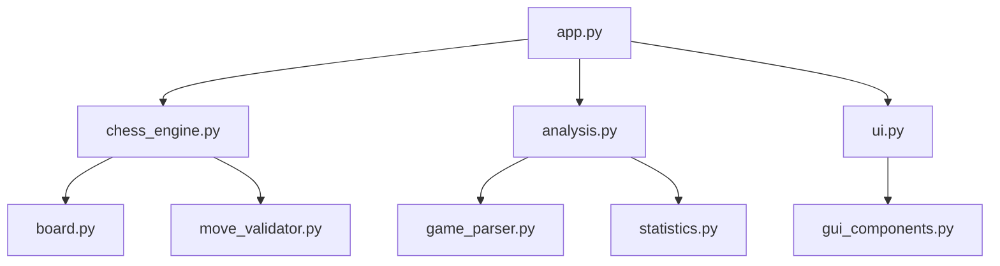

# File Level Diagram for app.py

```mermaid
graph TD
    A[app.py] --> B[chess_engine.py]
    A --> C[analysis.py]
    A --> D[ui.py]
    B --> E[board.py]
    B --> F[move_validator.py]
    C --> G[game_parser.py]
    C --> H[statistics.py]
    D --> I[gui_components.py]
```
