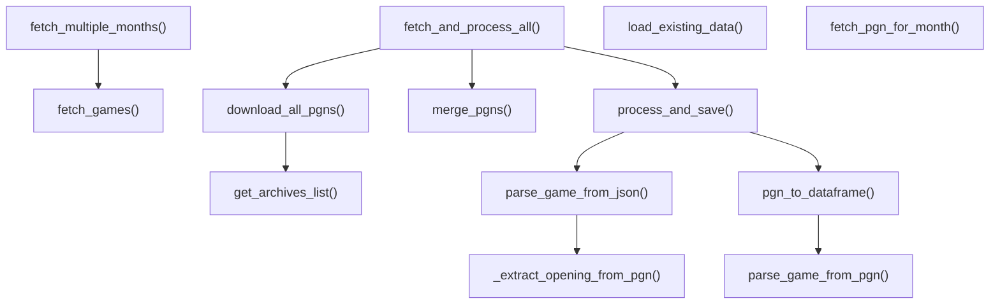

```mermaid
flowchart TD
    %% Entry points
    fetch_and_process_all["fetch_and_process_all()"]
    fetch_multiple_months["fetch_multiple_months()"]
    process_and_save["process_and_save()"]
    load_existing_data["load_existing_data()"]

    %% Fetching (API)
    get_archives_list["get_archives_list()"]
    fetch_games["fetch_games()"]
    fetch_pgn_for_month["fetch_pgn_for_month()"]
    download_all_pgns["download_all_pgns()"]

    %% PGN handling
    merge_pgns["merge_pgns()"]
    pgn_to_dataframe["pgn_to_dataframe()"]

    %% Parsing
    parse_game_from_json["parse_game_from_json()"]
    parse_game_from_pgn["parse_game_from_pgn()"]
    extract_opening["_extract_opening_from_pgn()"]

    %% Relationships — high-level workflows
    fetch_and_process_all --> download_all_pgns
    fetch_and_process_all --> merge_pgns
    fetch_and_process_all --> process_and_save

    fetch_multiple_months --> fetch_games
    process_and_save --> parse_game_from_json
    process_and_save --> pgn_to_dataframe

    %% Download workflow
    download_all_pgns --> get_archives_list

    %% PGN workflow
    pgn_to_dataframe --> parse_game_from_pgn

    %% Parsing internals
    parse_game_from_json --> extract_opening
```