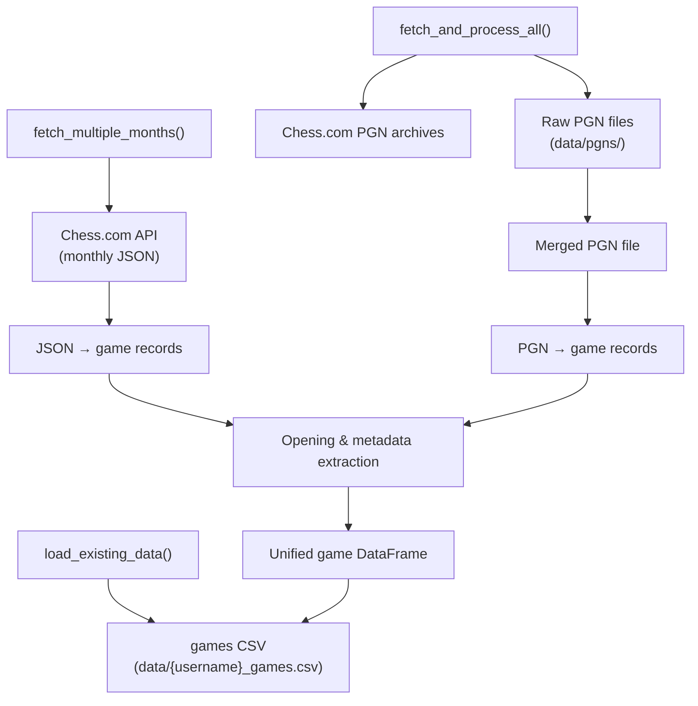

```mermaid
flowchart TD

    %% Entry points
    EP1["fetch_and_process_all()"]
    EP2["fetch_multiple_months()"]
    EP3["load_existing_data()"]

    %% Data acquisition
    ACQ1["Chess.com API\n(monthly JSON)"]
    ACQ2["Chess.com PGN archives"]

    %% Local storage
    STORE1["Raw PGN files\n(data/pgns/)"]
    STORE2["Merged PGN file"]

    %% Parsing & normalization
    PARSE1["JSON → game records"]
    PARSE2["PGN → game records"]
    PARSE3["Opening & metadata extraction"]

    %% Dataset assembly
    DATASET["Unified game DataFrame"]

    %% Persistence
    CSV["games CSV\n(data/{username}_games.csv)"]

    %% Entry point flows
    EP1 --> ACQ2
    EP1 --> STORE1
    STORE1 --> STORE2
    STORE2 --> PARSE2

    EP2 --> ACQ1
    ACQ1 --> PARSE1

    EP3 --> CSV

    %% Parsing internals
    PARSE1 --> PARSE3
    PARSE2 --> PARSE3

    %% Convergence
    PARSE3 --> DATASET
    DATASET --> CSV
```