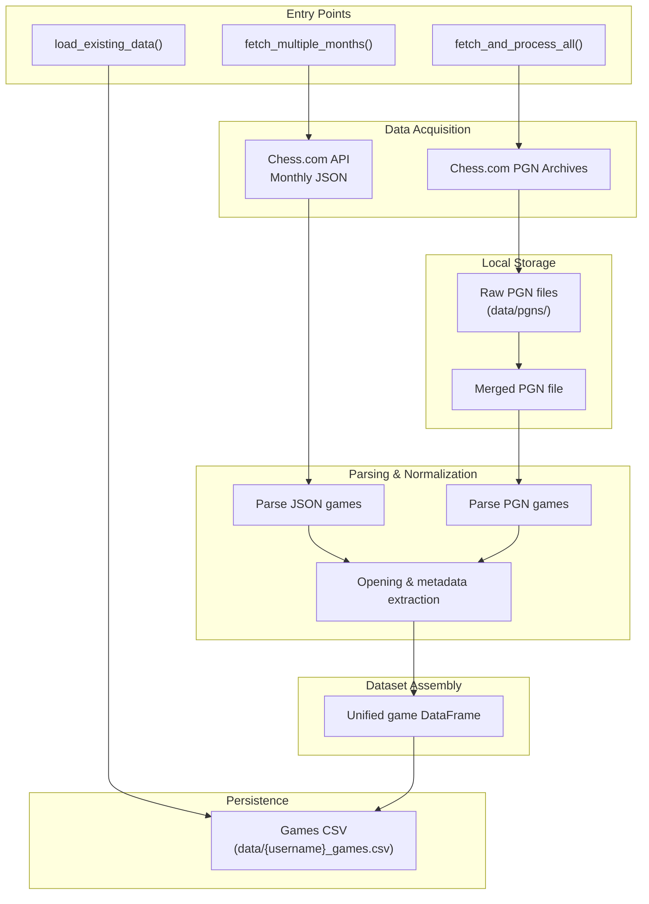

```mermaid
flowchart TD

    %% =========================
    %% Entry points
    %% =========================
    subgraph ENTRY["Entry Points"]
        EP1["fetch_and_process_all()"]
        EP2["fetch_multiple_months()"]
        EP3["load_existing_data()"]
    end

    %% =========================
    %% Data acquisition
    %% =========================
    subgraph ACQUISITION["Data Acquisition"]
        API_JSON["Chess.com API\nMonthly JSON"]
        API_PGN["Chess.com PGN Archives"]
    end

    %% =========================
    %% Local storage
    %% =========================
    subgraph STORAGE["Local Storage"]
        PGN_FILES["Raw PGN files\n(data/pgns/)"]
        MERGED_PGN["Merged PGN file"]
    end

    %% =========================
    %% Parsing and normalization
    %% =========================
    subgraph PARSING["Parsing & Normalization"]
        PARSE_JSON["Parse JSON games"]
        PARSE_PGN["Parse PGN games"]
        METADATA["Opening & metadata extraction"]
    end

    %% =========================
    %% Dataset assembly
    %% =========================
    subgraph DATASET["Dataset Assembly"]
        DF["Unified game DataFrame"]
    end

    %% =========================
    %% Persistence
    %% =========================
    subgraph PERSISTENCE["Persistence"]
        CSV["Games CSV\n(data/{username}_games.csv)"]
    end

    %% Entry flows
    EP1 --> API_PGN
    EP2 --> API_JSON
    EP3 --> CSV

    %% Acquisition flows
    API_PGN --> PGN_FILES
    PGN_FILES --> MERGED_PGN
    API_JSON --> PARSE_JSON

    %% Parsing flows
    MERGED_PGN --> PARSE_PGN
    PARSE_JSON --> METADATA
    PARSE_PGN --> METADATA

    %% Convergence
    METADATA --> DF
    DF --> CSV
```