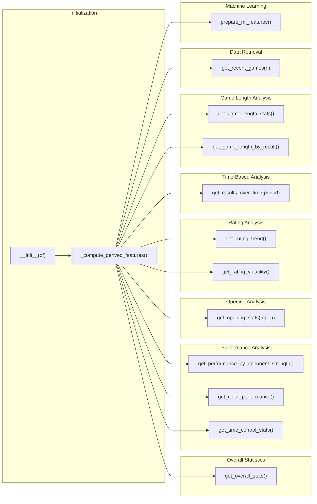

```mermaid
flowchart LR

    %% ======================================================
    %% Entry point
    %% ======================================================
    subgraph INIT["Initialization"]
        __init__["__init__(df)"]
        _compute_derived_features["_compute_derived_features()"]
    end

    %% ======================================================
    %% Overall statistics
    %% ======================================================
    subgraph OVERALL["Overall Statistics"]
        get_overall_stats["get_overall_stats()"]
    end

    %% ======================================================
    %% Performance analysis
    %% ======================================================
    subgraph PERFORMANCE["Performance Analysis"]
        get_performance_by_opponent_strength["get_performance_by_opponent_strength()"]
        get_color_performance["get_color_performance()"]
        get_time_control_stats["get_time_control_stats()"]
    end

    %% ======================================================
    %% Opening analysis
    %% ======================================================
    subgraph OPENINGS["Opening Analysis"]
        get_opening_stats["get_opening_stats(top_n)"]
    end

    %% ======================================================
    %% Rating analysis
    %% ======================================================
    subgraph RATING["Rating Analysis"]
        get_rating_trend["get_rating_trend()"]
        get_rating_volatility["get_rating_volatility()"]
    end

    %% ======================================================
    %% Time-based analysis
    %% ======================================================
    subgraph TIMEBASED["Time-Based Analysis"]
        get_results_over_time["get_results_over_time(period)"]
    end

    %% ======================================================
    %% Game length analysis
    %% ======================================================
    subgraph GAMELENGTH["Game Length Analysis"]
        get_game_length_stats["get_game_length_stats()"]
        get_game_length_by_result["get_game_length_by_result()"]
    end

    %% ======================================================
    %% Data retrieval
    %% ======================================================
    subgraph RETRIEVAL["Data Retrieval"]
        get_recent_games["get_recent_games(n)"]
    end

    %% ======================================================
    %% Machine learning
    %% ======================================================
    subgraph ML["Machine Learning"]
        prepare_ml_features["prepare_ml_features()"]
    end

    %% ======================================================
    %% Initialization workflow
    %% ======================================================
    __init__ --> _compute_derived_features

    %% ======================================================
    %% Dependencies on derived features
    %% ======================================================
    _compute_derived_features --> get_overall_stats
    _compute_derived_features --> get_performance_by_opponent_strength
    _compute_derived_features --> get_color_performance
    _compute_derived_features --> get_time_control_stats
    _compute_derived_features --> get_opening_stats
    _compute_derived_features --> get_rating_trend
    _compute_derived_features --> get_rating_volatility
    _compute_derived_features --> get_results_over_time
    _compute_derived_features --> get_game_length_stats
    _compute_derived_features --> get_game_length_by_result
    _compute_derived_features --> get_recent_games
    _compute_derived_features --> prepare_ml_features
```