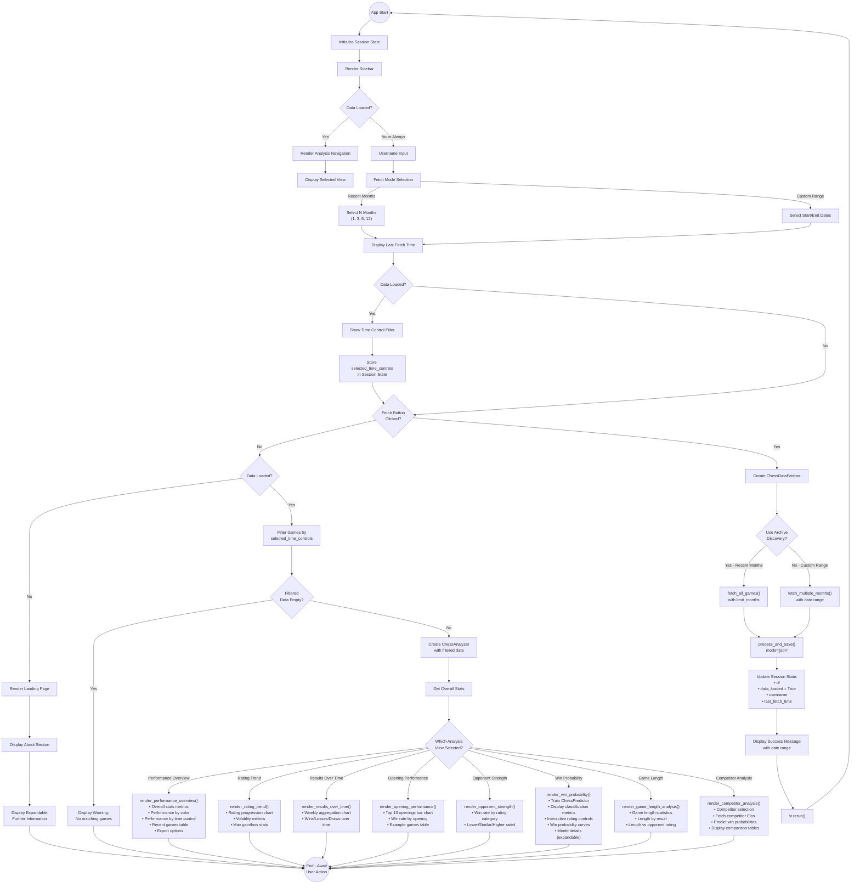

```mermaid
graph TD
    A((App Start)) --> B["Initialize Session State"]
    B --> C["Render Sidebar"]
    
    %% =========================
    %% Sidebar - Data Loaded Check
    %% =========================
    C --> C0{"Data Loaded?"}
    C0 -->|Yes| C01["Render Analysis Navigation"]
    C01 --> C02["Display Selected View"]
    C0 -->|No or Always| C1["Username Input"]
    
    %% =========================
    %% Sidebar - Fetch Configuration
    %% =========================
    C1 --> C2["Fetch Mode Selection"]
    C2 -->|Recent Months| C21["Select N Months<br/>(1, 3, 6, 12)"]
    C2 -->|Custom Range| C22["Select Start/End Dates"]
    C21 --> C3["Display Last Fetch Time"]
    C22 --> C3
    
    %% =========================
    %% Sidebar - Time Control Filter
    %% =========================
    C3 --> C4{"Data Loaded?"}
    C4 -->|Yes| C5["Show Time Control Filter"]
    C5 --> C6["Store selected_time_controls<br/>in Session State"]
    C4 -->|No| D
    C6 --> D
    
    %% =========================
    %% Fetch Decision
    %% =========================
    D{"Fetch Button<br/>Clicked?"}
    D -->|No| E{"Data Loaded?"}
    D -->|Yes| F["Create ChessDataFetcher"]
    
    %% =========================
    %% Data Fetching Flow
    %% =========================
    F --> G{"Use Archive<br/>Discovery?"}
    G -->|Yes - Recent Months| G1["fetch_all_games()<br/>with limit_months"]
    G -->|No - Custom Range| G2["fetch_multiple_months()<br/>with date range"]
    
    G1 --> H["process_and_save()<br/>mode='json'"]
    G2 --> H
    
    H --> I["Update Session State:<br/>• df<br/>• data_loaded = True<br/>• username<br/>• last_fetch_time"]
    I --> J["Display Success Message<br/>with date range"]
    J --> K["st.rerun()"]
    K --> A
    
    %% =========================
    %% No Data - Landing Page
    %% =========================
    E -->|No| L["Render Landing Page"]
    L --> L1["Display About Section"]
    L1 --> L2["Display Expandable<br/>Further Information"]
    L2 --> Z((End - Await<br/>User Action))
    
    %% =========================
    %% Data Loaded - Analysis Flow
    %% =========================
    E -->|Yes| P["Filter Games by<br/>selected_time_controls"]
    P --> P1{"Filtered<br/>Data Empty?"}
    P1 -->|Yes| P2["Display Warning:<br/>No matching games"]
    P2 --> Z
    P1 -->|No| Q["Create ChessAnalyzer<br/>with filtered data"]
    
    Q --> R["Get Overall Stats"]
    R --> N{"Which Analysis<br/>View Selected?"}
    
    %% =========================
    %% Analysis View Branches
    %% =========================
    N -->|Performance Overview| O1["render_performance_overview()<br/>• Overall stats metrics<br/>• Performance by color<br/>• Performance by time control<br/>• Recent games table<br/>• Export options"]
    
    N -->|Rating Trend| O2["render_rating_trend()<br/>• Rating progression chart<br/>• Volatility metrics<br/>• Max gain/loss stats"]
    
    N -->|Results Over Time| O3["render_results_over_time()<br/>• Weekly aggregation chart<br/>• Wins/Losses/Draws over time"]
    
    N -->|Opening Performance| O4["render_opening_performance()<br/>• Top 10 openings bar chart<br/>• Win rate by opening<br/>• Example games table"]
    
    N -->|Opponent Strength| O5["render_opponent_strength()<br/>• Win rate by rating category<br/>• Lower/Similar/Higher rated"]
    
    N -->|Win Probability| O6["render_win_probability()<br/>• Train ChessPredictor<br/>• Display classification metrics<br/>• Interactive rating controls<br/>• Win probability curves<br/>• Model details (expandable)"]
    
    N -->|Game Length| O7["render_game_length_analysis()<br/>• Game length statistics<br/>• Length by result<br/>• Length vs opponent rating"]
    
    N -->|Competitor Analysis| O8["render_competitor_analysis()<br/>• Competitor selection<br/>• Fetch competitor Elos<br/>• Predict win probabilities<br/>• Display comparison tables"]
    
    %% =========================
    %% Terminal States
    %% =========================
    O1 --> Z
    O2 --> Z
    O3 --> Z
    O4 --> Z
    O5 --> Z
    O6 --> Z
    O7 --> Z
    O8 --> Z
```