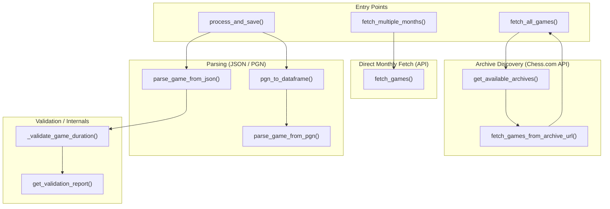

```mermaid
flowchart TD

    %% ======================================================
    %% Entry points
    %% ======================================================
    subgraph ENTRY["Entry Points"]
        fetch_all_games["fetch_all_games()"]
        fetch_multiple_months["fetch_multiple_months()"]
        process_and_save["process_and_save()"]
    end

    %% ======================================================
    %% Archive discovery (Chess.com API)
    %% ======================================================
    subgraph ARCHIVES["Archive Discovery (Chess.com API)"]
        get_available_archives["get_available_archives()"]
        fetch_games_from_archive_url["fetch_games_from_archive_url()"]
    end

    %% ======================================================
    %% Direct monthly fetch (API)
    %% ======================================================
    subgraph MONTHLY["Direct Monthly Fetch (API)"]
        fetch_games["fetch_games()"]
    end

    %% ======================================================
    %% Parsing (JSON / PGN)
    %% ======================================================
    subgraph PARSING["Parsing (JSON / PGN)"]
        parse_game_from_json["parse_game_from_json()"]
        parse_game_from_pgn["parse_game_from_pgn()"]
        pgn_to_dataframe["pgn_to_dataframe()"]
    end

    %% ======================================================
    %% Validation / internals
    %% ======================================================
    subgraph VALIDATION["Validation / Internals"]
        validate_duration["_validate_game_duration()"]
        get_validation_report["get_validation_report()"]
    end

    %% ======================================================
    %% High-level workflows
    %% ======================================================
    fetch_all_games --> get_available_archives
    get_available_archives --> fetch_games_from_archive_url
    fetch_games_from_archive_url --> fetch_all_games

    fetch_multiple_months --> fetch_games

    process_and_save --> parse_game_from_json
    process_and_save --> pgn_to_dataframe

    %% ======================================================
    %% PGN workflow
    %% ======================================================
    pgn_to_dataframe --> parse_game_from_pgn

    %% ======================================================
    %% Parsing internals
    %% ======================================================
    parse_game_from_json --> validate_duration

    %% ======================================================
    %% Reporting
    %% ======================================================
    validate_duration --> get_validation_report
```