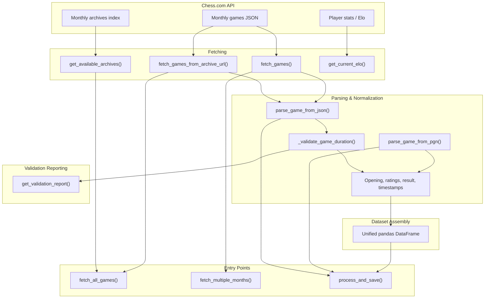

```mermaid
flowchart TD

    %% =========================
    %% Entry points (public API)
    %% =========================
    subgraph ENTRY["Entry Points"]
        EP1["fetch_all_games()"]
        EP2["fetch_multiple_months()"]
        EP3["process_and_save()"]
    end

    %% =========================
    %% Chess.com API
    %% =========================
    subgraph API["Chess.com API"]
        ARCHIVES["Monthly archives index"]
        MONTH_JSON["Monthly games JSON"]
        STATS["Player stats / Elo"]
    end

    %% =========================
    %% Fetching layer
    %% =========================
    subgraph FETCHING["Fetching"]
        GET_ARCHIVES["get_available_archives()"]
        FETCH_ARCHIVE["fetch_games_from_archive_url()"]
        FETCH_MONTH["fetch_games()"]
        FETCH_ELO["get_current_elo()"]
    end

    %% =========================
    %% Parsing & normalization
    %% =========================
    subgraph PARSING["Parsing & Normalization"]
        PARSE_JSON["parse_game_from_json()"]
        PARSE_PGN["parse_game_from_pgn()"]
        VALIDATE[" _validate_game_duration()"]
        NORMALISE["Opening, ratings, result, timestamps"]
    end

    %% =========================
    %% Dataset assembly
    %% =========================
    subgraph DATASET["Dataset Assembly"]
        DF["Unified pandas DataFrame"]
    end

    %% =========================
    %% Reporting
    %% =========================
    subgraph REPORTING["Validation Reporting"]
        REPORT["get_validation_report()"]
    end

    %% =========================
    %% Entry-point sinks
    %% =========================
    GET_ARCHIVES --> EP1
    FETCH_ARCHIVE --> EP1

    FETCH_MONTH --> EP2

    PARSE_JSON --> EP3
    PARSE_PGN --> EP3

    %% =========================
    %% API → Fetching
    %% =========================
    ARCHIVES --> GET_ARCHIVES
    MONTH_JSON --> FETCH_ARCHIVE
    MONTH_JSON --> FETCH_MONTH
    STATS --> FETCH_ELO

    %% =========================
    %% Fetching → Parsing
    %% =========================
    FETCH_ARCHIVE --> PARSE_JSON
    FETCH_MONTH --> PARSE_JSON

    %% =========================
    %% Parsing internals
    %% =========================
    PARSE_JSON --> VALIDATE
    VALIDATE --> NORMALISE

    PARSE_PGN --> NORMALISE

    %% =========================
    %% Convergence
    %% =========================
    NORMALISE --> DF
    DF --> EP3

    %% =========================
    %% Reporting flow
    %% =========================
    VALIDATE --> REPORT
```