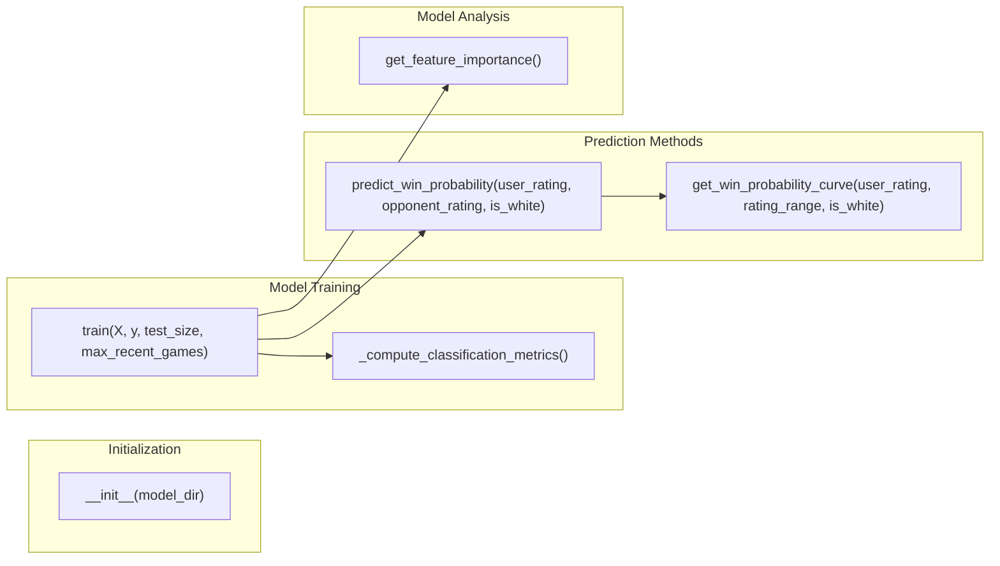

```mermaid
flowchart LR

    %% ======================================================
    %% Entry point
    %% ======================================================
    subgraph INIT["Initialization"]
        __init__["__init__(model_dir)"]
    end

    %% ======================================================
    %% Training workflow
    %% ======================================================
    subgraph TRAINING["Model Training"]
        train["train(X, y, test_size, max_recent_games)"]
        _compute_classification_metrics["_compute_classification_metrics()"]
    end

    %% ======================================================
    %% Prediction methods
    %% ======================================================
    subgraph PREDICTION["Prediction Methods"]
        predict_win_probability["predict_win_probability(user_rating, opponent_rating, is_white)"]
        get_win_probability_curve["get_win_probability_curve(user_rating, rating_range, is_white)"]
    end

    %% ======================================================
    %% Analysis methods
    %% ======================================================
    subgraph ANALYSIS["Model Analysis"]
        get_feature_importance["get_feature_importance()"]
    end

    %% ======================================================
    %% Training workflow
    %% ======================================================
    train --> _compute_classification_metrics

    %% ======================================================
    %% Prediction dependencies
    %% ======================================================
    train --> predict_win_probability
    predict_win_probability --> get_win_probability_curve

    %% ======================================================
    %% Analysis dependencies
    %% ======================================================
    train --> get_feature_importance
```